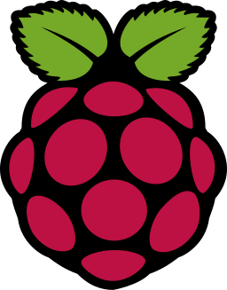

# Guy Francoeur

## Bienvenue sur mon profile github

###  Étudiants UQAM

 - [Cliquer ici](https://guyfrancoeur.github.io)

### Mes commenditaires

#### License académique disponible
 - erwin DM (Data Modeler)

### Cloud

  
  
  
  

### Langages

  
  
    
  
  
  
   
  
  
  

### Librairie

 
 
 

### Outils
  
  
  
  
  

### Hardware
  
  
  
### OS
  
  

### Backend et connectivité synchrone

  
  

### Base de données

  
  
  
  
  
  
  
  
    
### Contribution github

---
Guy Francoeur édition 2021
